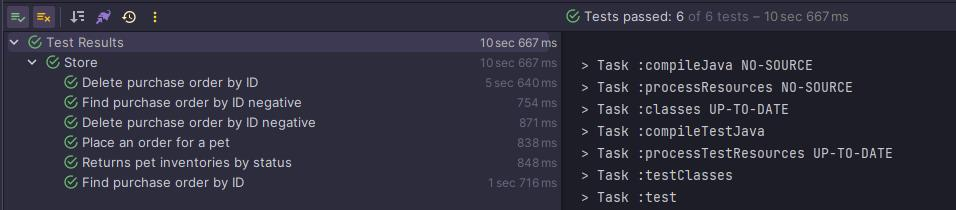
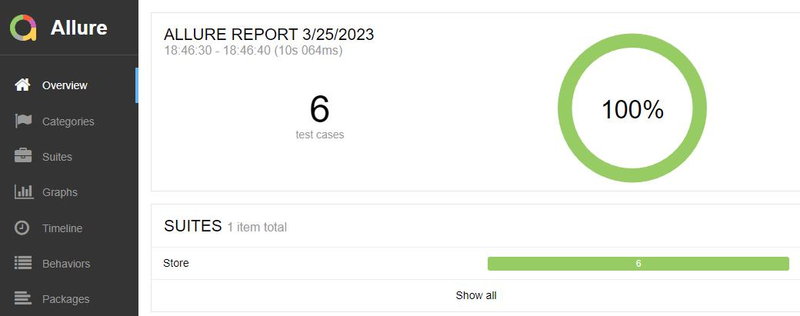
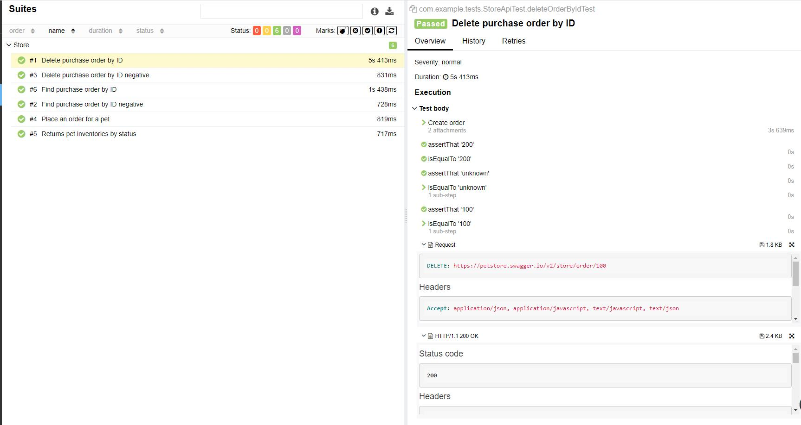

## Детализация
- data - генерация тестовых данных
- helpers - подключение отчетов, метод для создания заказа
- models - DTO
- spec - спецификации
- tests - тесты
- TestBase - базовый класс

## Как запустить

1) Для очистки build директории выполняем задачу
`clean`

2) Для прогона тестов выполняем задачу `test`
3) Для скачивания Allure выполняем команду `downloadAllure`

4) Для генерации отчета выполняем задачу `allureServe`

Скриншоты отчета:

